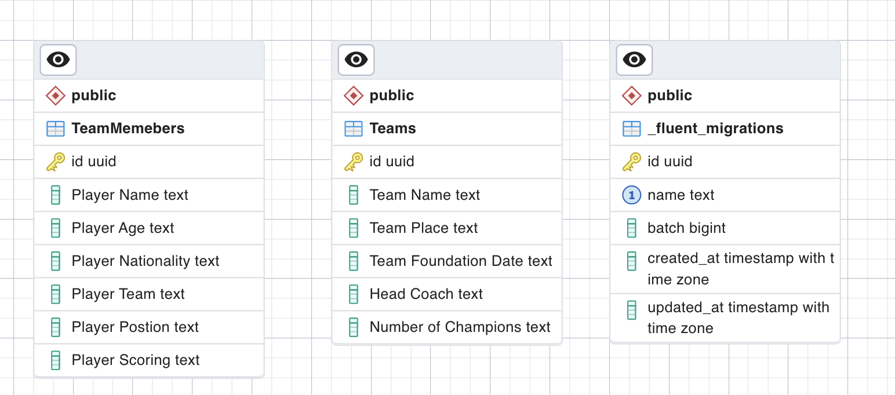

# Sportology

<h1>Big Idea:</h1>  

 Create a football database and APIs 

<h1> App Statment:  </h1>

 An API that provide Saudi football data  

<h2>Features Included :</h2>

 1- Get all football teams  
 2- Add new football teams  
 3- Delete team or team member 
 4- Update team member info 
 5- Update teams info 

<h2>Language Supported: :</h2>

 1- English 

<h2>Tools:</h2>

[![SwiftUI][SwiftUI-img]][SwiftUI-url] [![Sketch][Sketch-img]][Sketch-url]

<h2>Team:</h2>

 Team 14 

<a href="https://www.linkedin.com/in/shahahd-qadi/">Shahad Qadi</a> - <a href="https://www.linkedin.com/in/razan-rubui-4a6228152/
">Lamia AlSiddiqi</a> - <a href="https://www.linkedin.com/in/razan-rubui-4a6228152/
">Lamia AlSiddiqi</a>

<h2> Project ERD </h2>
  

<!-- MARKDOWN LINKS & IMAGES -->
<!-- https://www.markdownguide.org/basic-syntax/#reference-style-links -->
[SwiftUI-img]: https://img.shields.io/badge/-Xcode-blue
[SwiftUI-url]: https://developer.apple.com/xcode
[Sketch-img]: https://img.shields.io/badge/-Vapor-yellow
[Sketch-url]: https://www.sketch.com!

[vapor-img]: https://img.shields.io/badge/-Vapor-purpule
[vapor-url]: https://vapor.codes

